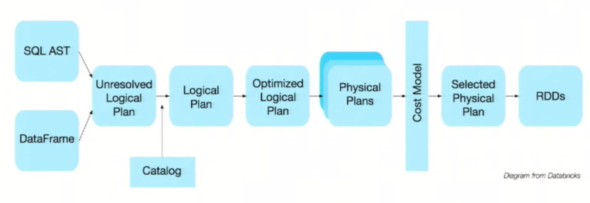
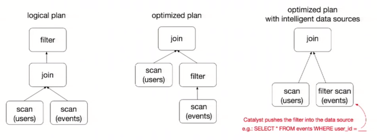
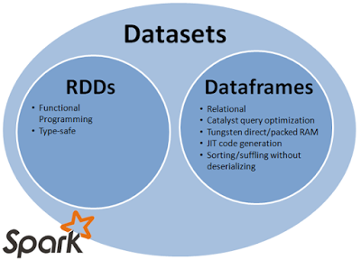

# Prerequisite
## What is Spark SQL?
**Spark SQL** is a component on top of Spark Core that introduces a new data abstraction called **DataFrame**, which provides support for structured and semi-structured data. The following illustration depicts the different components of Spark.


There are several ways to interact with Spark SQL including SQL and the Dataset API. When computing a result the same execution engine is used, independent of which API/language you are using to express the computation. This unification means that developers can easily switch back and forth between different APIs based on which provides the most natural way to express a given transformation.

A **DataFrame** is a distributed collection of data organized into named columns. It is conceptually equivalent to a table in a relational database or a R/Python Dataframe. Along with Dataframe, Spark also introduced catalyst optimizer, which leverages advanced programming features to build an extensible query optimizer.

DataFrame offers huge performance improvement over RDDs because of twp power features it has:
- Custom Memory management (aka Project Tungsten)
- Optimized Execution Plans (aka Catalyst Optimizer)

Query plans are created for execution using Spark catalyst optimiser. After an optimised execution plan is prepared going through some steps, the final execution happens internally on RDDs only but that's completely hidden from the users.



Consider a query as below:
```scala
users.join(events, users("id") === events("uid"))
	   .filter(events("date") > "2015-01-01")
```



In the above query, filter is used before join which is a costly shuffle operation. The logical plan sees that and in optimised logical plan, this filter is pushed to execute before join. In the optimised execution plan, it can leverage datasource capabilities also and push that filter further down to datasource so that it can apply that filter on the disk level rather than bringing all data in memory and doing filter in memory (which is not possible while directly using RDDs). So filter method now effectively works like a WHERE clause in a database query. Also with optimised data sources like parquet, if Spark sees that you need only few columns to compute the results , it will read and fetch only those columns from parquet saving both disk IO and memory.

# Tool Demo

We demonstrate Spark SQL on Databricks platform. You can find detailed instructions about Databricks platform from Angela Chen's previous demo presentation [here](https://angelahschen.github.io/cs239demo/).

## Creating a SparkSession

The entry point into all functionality in Spark is the SparkSession class. To create a basic SparkSession, just use `SparkSession.builder()`:

```scala
import org.apache.spark.sql.SparkSession

val spark = SparkSession
  .builder()
  .appName("Spark SQL basic example")
  .config("spark.some.config.option", "some-value")
  .getOrCreate()
```

Note that In Databricks notebooks and Spark REPL, the SparkSession has been created automatically and assigned to variable "spark".

## Reading Data

Spark SQL supports operating on a variety of data sources through the DataFrame interface. 

```scala
val dataPath = "/FileStore/tables/xpndkxz61488961968033/movie_metadata.csv"
val movieDF = sqlContext.read.format("com.databricks.spark.csv").option("header","true").option("inferSchema","true").load(dataPath)
```

## Running SQL Queries

SparkSession can be used to execute SQL queries over data, getting the results back as a DataFrame (i.e. Dataset[Row]).
A DataFrame can be operated on using relational transformations and can also be used to create a temporary view. Registering a DataFrame as a temporary view allows you to run SQL queries over its data.

```scala
movieDF.createOrReplaceTempView("movie")
display(movieDF)
display(spark.sql("describe movie"))

spark.sql("select director_name, movie_title  from movie where director_name = 'James Cameron'").show
spark.sql("select AVG(imdb_score)  from movie where director_name = 'James Cameron'").show
spark.sql("select movie_title, imdb_score from movie where imdb_score > 9 ").show
```

Alternatively, you can use the DataFrame APIs to conduct queries as well.

```scala
movieDF.filter("director_name = 'James Cameron'").select($"director_name", $"movie_title").show
movieDF.filter("director_name = 'James Cameron'").select(avg($"imdb_score")).show
movieDF.filter("imdb_score > 9").select($"movie_title", $"imdb_score").show
```

## More Dataset Operators
You can refer to [Dataset APIs](http://spark.apache.org/docs/latest/api/scala/index.html#org.apache.spark.sql.Dataset) and [functions](http://spark.apache.org/docs/latest/api/scala/index.html#org.apache.spark.sql.functions$) for more details. org.apache.spark.sql.functions object offers many built-in functions to process values in Columns in Datasets.
There are over 300 functions in the functions object. Some functions are transformations of Column objects (or column names) into other Column objects or transform DataFrame into DataFrame.

Below we show one example.

```scala
import org.apache.spark.sql.functions._
table1.withColumn("director_name", upper($"director_name")).show
```

## UDFs - User-Defined Functions

User-Defined Functions (aka UDF) is a feature of Spark SQL to define new Column-based functions that extend the vocabulary of Spark SQL’s DSL for transforming Datasets.

```scala
def makeDT(movie_title: String, director_name: String) = s"1:$movie_title 2:$director_name"
sqlContext.udf.register("makeDt", makeDT(_:String,_:String))
sqlContext.sql("SELECT imdb_score, makeDt(movie_title, director_name) from movie").show(10)
```

# RDDs vs. DataFrame vs. Dataset

With Spark 2.0, there are 3 types of data abstractions which Spark officially provides to use: RDD, DataFrame and Dataset. The following illustration depicts the relationship them.



Evolution of these abstractions happened in this way:

RDD(Spark 1.0) -> DataFrame (Spark 1.3) -> Dataset (Spark 1.6)

Given the same data, each of the 3 abstractions will compute and give same results to the user. But they differ in performance and the ways they compute. In Spark 2.0, DataFrame APIs have merged with Datasets APIs, unifying data processing capabilities across libraries. In future, Dataset will eventually replace RDD and DataFrame to become the only API spark users should be using in code.

[This thread](http://stackoverflow.com/questions/37301226/difference-between-dataset-api-and-dataframe) on Stack Overflow discusses the differences among these three abstractions in detail. We have made a brief digest as below.

A **resilient distributed dataset (RDD)** is a collection of elements partitioned across the nodes of the cluster that can be operated on in parallel.

However, When working with structured data, RDDs cannot take advantages of Spark’s advanced optimizers including catalyst optimizer and Tungsten execution engine. Developers need to optimize each RDD based on its attributes.

A **DataFrame** is a distributed collection of data organized into named columns. It is conceptually equivalent to a table in a relational database, but with richer optimizations under the hood.

However, Dataframe API does not support compile time safety which limits you from manipulating data when the structure is not know. The following example works during compile time. However, you will get a Runtime exception when executing this code.

```scala
val dataframe = sqlContect.read.json("people.json") 
dataframe.filter("salary > 10000").show 
=> throws Exception : cannot resolve 'salary' given input age , name
```

Dataset API is an extension to DataFrames that provides a type-safe, object-oriented programming interface. It is a strongly-typed, immutable collection of objects that are mapped to a relational schema.

```scala
case class Person(name : String , age : Int)
val personRDD = sc.makeRDD(Seq(Person("A",10),Person("B",20)))
val personDF = sqlContect.createDataframe(personRDD)
val ds:Dataset[Person] = personDF.as[Person]
ds.filter(p => p.age > 25)
ds.filter(p => p.salary > 25)
 // error : value salary is not a member of person
ds.rdd // returns RDD[Person]
```

The illustration below shows the comparison of SQL vs. DataFrame vs. Dataset.


## Creating Datasets

Datasets are similar to RDDs, however, instead of using Java serialization or Kryo they use a specialized Encoder to serialize the objects for processing or transmitting over the network. While both encoders and standard serialization are responsible for turning an object into bytes, encoders are code generated dynamically and use a format that allows Spark to perform many operations like filtering, sorting and hashing without deserializing the bytes back into an object.

```scala
case class Person(name: String, age: Long)
val caseClassDS = Seq(Person("Andy", 32)).toDS()
caseClassDS.show()
```

DataFrames can be converted to a Dataset by providing a class. Mapping will be done by name.

```scala
case class Person(name: String, salary: Long)
val path = "/FileStore/tables/418k56zy1488673266035/people.json"
val peopleDS = spark.read.json(path).as[Person]
peopleDS.show()
```

## Interoperating with RDDs

Spark SQL supports two different methods for converting existing RDDs into Datasets. The first method uses reflection to infer the schema of an RDD that contains specific types of objects. This reflection based approach leads to more concise code and works well when you already know the schema while writing your Spark application.

```scala
// Create an RDD of Person objects from a text file, convert it to a Dataframe
case class Person(name: String, age: Long)
val peopleDF = spark.sparkContext.textFile("/FileStore/tables/1sb6uixq1488676481577/people.txt")
.map(_.split(","))
.map(attributes => Person(attributes(0), attributes(1).trim.toInt))
.toDF()

// Register the DataFrame as a temporary view
peopleDF.createOrReplaceTempView("people")

// SQL statements can be run by using the sql methods provided by Spark
val teenagersDF = spark.sql("SELECT name, age FROM people WHERE age BETWEEN 13 AND 19")
teenagersDF.map(teenager => "Name: " + teenager(0)).show()
teenagersDF.map(teenager => "Name: " + teenager.getAs[String]("name")).show()
```

The second method for creating Datasets is through a programmatic interface that allows you to construct a schema and then apply it to an existing RDD. While this method is more verbose, it allows you to construct Datasets when the columns and their types are not known until runtime.

```scala
import org.apache.spark.sql.types._
// Create an RDD
val peopleRDD = spark.sparkContext.textFile("/FileStore/tables/1sb6uixq1488676481577/people.txt")

// The schema is encoded in a string
val schemaString = "name age"

// Generate the schema based on the string of schema
val fields = schemaString.split(" ")
  .map(fieldName => StructField(fieldName, StringType, nullable = true))
val schema = StructType(fields)

// Convert records of the RDD (people) to Rows
val rowRDD = peopleRDD
  .map(_.split(","))
  .map(attributes => Row(attributes(0), attributes(1).trim))

// Apply the schema to the RDD
val peopleDF = spark.createDataFrame(rowRDD, schema)

// Creates a temporary view using the DataFrame
peopleDF.createOrReplaceTempView("people")

// SQL can be run over a temporary view created using DataFrames
val results = spark.sql("SELECT name FROM people")
results.map(attributes => "Name: " + attributes(0)).show()
```

# References
1.	http://stackoverflow.com/questions/37301226/difference-between-dataset-api-and-dataframe
2.	http://why-not-learn-something.blogspot.com/2016/07/apache-spark-rdd-vs-dataframe-vs-dataset.html
3.	http://spark.apache.org/docs/latest/sql-programming-guide.html
4.	https://jaceklaskowski.gitbooks.io/mastering-apache-spark/
5.	https://databricks.com/blog/2016/07/14/a-tale-of-three-apache-spark-apis-rdds-dataframes-and-datasets.html
6.	http://www.sparktutorials.net/using-sparksql-udfs-to-create-date-times-in-spark-1.5
